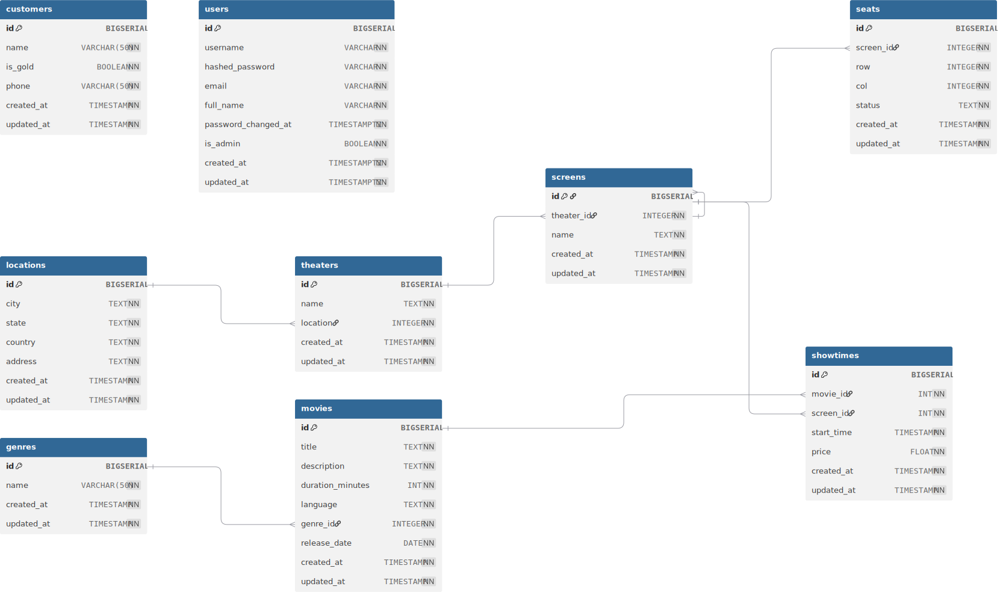

# 🎬 Movie Booking System

A full-stack web application for managing and booking movie tickets — including users, theaters, screens, seats, showtimes, and payments.

---

## 🚀 Features

### 🎟 User Experience

- Browse movies by genre, language, or release date
- View available showtimes by theater and screen
- Select seats and book/reserve tickets
- Secure authentication & admin access

### ⚙️ Admin Panel

- Manage movies, genres, theaters, screens
- Configure showtimes and pricing
- Seat layout creation per screen
- Real-time availability management

### 🧩 Tech Stack

| Layer      | Tech                   |
| ---------- | ---------------------- |
| Frontend   | React.js + Bootstrap   |
| Backend    | Go (Gin)               |
| Database   | PostgreSQL             |
| ORM        | SQLC                   |
| Auth       | JWT / Paseto           |
| Scheduling | Ansible (optional)     |
| Deployment | Docker, Docker Compose |

---

## 🗂 Project Structure

```sh
.
├── backend/            # Go API using Gin + SQLC
├── frontend/           # React app for booking and admin dashboard
├── migrations/         # PostgreSQL schema files
├── services/           # API calls from frontend
├── utils/              # Shared helpers (date formatting, auth, etc.)
└── README.md
```

## TODO

1. Update Readme file.
2. Update the **docker-compose.yaml** file to deploy all the frontend,backend and database properly.
3. Create a deployment manifests for k8s.
4. Create application architecture.

## Database Architecture



## Application Architecture

## Building container Images

### Frontend

```bash
cd frontend
make create-container-image
```

### Backend

```bash
cd backend
make create-container-image
```

## Deployment

### Docker

```bash
docker-compose up -d
```
